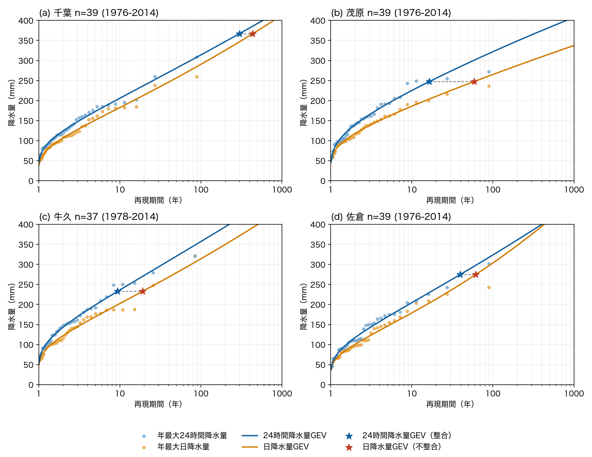

# 令和８年８月千葉豪雨は「過去の気候ではほぼ起こり得ない大雨」か？

## 記事中で違和感を持った点

『千葉県で500mm超の記録的大雨「過去ならほぼ起こり得ない規模」の発生確率が温暖化で2倍以上に』という記事を読んだ。

記事中では次のような表現がなされていた。

> 千葉市緑区から市原市東部では、574.2mmの雨量となりました。過去の気候では、この規模の大雨が起こる確率は0.001％ほどで、頻度にすると1万年を大きく超える規模に相当します（※原文ママ）。統計上、ほぼ起こり得ないレベルの大雨だったとみられます。

[ウェザーニュース「千葉県で500mm超の記録的大雨」](https://weathernews.jp/news/202608/140251/)

（※）0.001%は再現期間にして約10万年に相当する。

この表現は、一研究者の視点から見てやや危ういように感じる。気になった点を4つに整理してみる。

### 1. 日降水量と24時間降水量が混ざっていないか

記事で使われている気候シミュレーションデータのNIES2020とNEX-GDDP-CMIP6は、いずれも日別のデータである。一方、評価対象となっている「574.2mm」などの雨量は、10分値などから求めた最大24時間降水量とみられる。0時から24時までの日降水量は、任意の24時間で積算した降水量より小さくなりやすいので、日降水量から推定した極値分布に最大24時間降水量をそのまま当てはめれば、再現期間は長めに偏る。

記事に書かれた説明を読む限り、この時間定義の違いをそろえる処理は示されていない。後述するアメダスの解析では、この不整合による影響が4地点すべてで確認できた。（ただし記事に書かれていない日降水量と24時間降水量の補正処理が行われた可能性はある）。

### 2. シミュレーションと解析雨量の違いは検証されているか

記事では、気候シミュレーションから推定した極値分布に解析雨量を当てはめて再現期間を出している。異なるデータを比べること自体は批判されるものではなく、この記事のように将来気候まで含めて評価するなら避けられない。問題は、両者の性質の違いを踏まえた検証が（少なくとも記事中では）示されていない点である。性質の違いとしては、たとえば次のようなものがある。

* 解析雨量は約1 km格子で、局地的な雨のピークをとらえたものである
* NEX-GDDP-CMIP6は約25 km格子で、空間平均としての性質が強い
* NIES2020は1 km格子だが、粗いGCMを統計的に内挿・補正したものであり、局地的な豪雨を1 kmスケールで物理的に再現しているわけではない
* バイアス補正で通常の雨の分布が合っていても、観測範囲を超える極端な裾の挙動までは十分に拘束されない

「過去の気候」については、解析雨量とモデルの年最大降水量や上位の分位点を、時間・空間スケールをそろえて比べれば、シミュレーションが大雨を過大評価・過小評価しているかを確認することができると考えられる。

### 3. 「1万年に1度」という伝え方

一般読者への伝え方として、「1万年を大きく超える」と書くと「完新世の間で起こり得ない珍しさ」のように実時間上の発生間隔のように読まれるおそれがある。再現期間は、ある気候状態を定常と仮定したときの年超過確率の逆数であって、（自然変動と人為起源を問わず）気候変動が起きる現実世界において、実際に平均1万年に1回起こるという意味ではない。このように解釈に注意が必要な概念であるため、外挿で得られる極端な値は直接示さない方が、科学コミュニケーションとしては誠実なように個人的には思う。

### 4. 解析期間と外挿の大きさ

最後に、39年間のデータから1万年超という再現期間を推定していることについて補足しておく。この書き方は大幅な外挿のように読めるため違和感を感じるが、複数のモデルアンサンブルを利用している場合、名目上の標本規模は解析期間よりも大きいのだと思われる。NIES2020なら5モデルで195モデル年、NEX-GDDP-CMIP6なら35モデルすべてで1,365モデル年になる。（あくまで推測だが、記事が1,182年までは具体的な数値を出し、1万年超では表現をぼかしているのは、このあたりを意識したのかもしれない）。

## 近隣の地上観測ではどれくらい稀だったのか？

1点目と2点目について、実際の観測データを用いて再現期間を計算した場合、どの程度の値になるだろうか。記事の結果と比較するには本来解析雨量を用いるのが望ましいが、オープンデータとして入手できない。そのため、アメダスの地上観測データを用いた解析を行うことにする。

### データ

気象庁「過去の気象データ検索」から、年最大24時間降水量と、2026年8月13～15日の最大24時間降水量を取得した。

対象地点は、元記事で再現期間が示された地域のうち、地域名と直接対応づけられる気象庁観測所があり、解析期間中の年最大値をほぼ連続して取得できる地点から選定した。具体的には、「千葉市中央区～若葉区付近」に「千葉」、「八千代・佐倉付近」に「佐倉」、「茂原市付近」に「茂原」、「市原市中部」に「牛久（市原市）」を対応させた。

「過去の気候」に対応する解析期間は、元記事の「1995年を中心とする約39年間」という記述から、中央年1995年の前後19年と解釈し1976～2014年とした。牛久はデータが得られる1978～2014年の37年間を使用した。

なお、日降水量は0時から24時までの降水量である。一方、24時間降水量は、2002年12月31日以前は時別値、2003年以降は10分値を用いて、各観測時刻までの連続する24時間の降水量を積算して求められている。年最大24時間降水量は、その年間最大値である。観測間隔の変更に対する補正は行っていない。

### 手法

各地点の年最大24時間降水量に定常GEV分布を当てはめ、Lモーメント法で母数を推定した。これは確率降水量を求める際の代表的な手法である。ただし、より厳密には複数の候補分布を当てはめ、適合度と推定値の安定性を比較するのが望ましい（寶・高棹, 1988；石原, 2010）。

2026年の豪雨は分布の推定には含めず、1976～2014年の分布に対する評価対象とした。今回の雨量 $x$ の年超過確率を $1 - F(x)$ とし、再現期間を $T = 1 / (1 - F(x))$ として計算した。

また、0時から24時までの日降水量と、時別値または10分値から連続する24時間分を積算した24時間降水量の違いを調べるため、同じ期間の年最大日降水量にも定常GEV分布を当てはめた。2026年豪雨の最大24時間降水量について、24時間降水量GEVに当てはめた「24時間降水量整合」と、日降水量GEVに当てはめた「日降水量GEVに24時間降水量」を比較した。後者は、日別データから推定した分布に観測24時間雨量を直接比較した場合の時間定義の不整合を模擬するものである。

この解析はCodexを使用して行った。ソースコードは[GitHubリポジトリ](https://github.com/wm-ytakano/chiba-heavy-rain)にある。

### 結果

表1では、4地点すべてで元記事の再現期間が「24時間降水量整合」の推定値を上回った。一方、最大24時間降水量を日降水量GEVに当てはめると、再現期間は4地点すべてで長くなり、元記事の値に近づいた。0時から24時までの日別データから推定した分布に、時別値または10分値から求めた24時間降水量を直接比較する時間定義の不整合は、再現期間を長く算出する一因になり得る。

**表1　地上観測から推定した再現期間と元記事に記載された再現期間の比較。** 計算値は、1976～2014年（牛久のみ1978～2014年）の年最大日降水量または年最大24時間降水量にLモーメント法による定常GEV分布を適用して求めた。「24時間降水量整合」は24時間降水量GEVに今回の最大24時間降水量を、「日降水量GEVに24時間降水量」は日降水量GEVに同じ最大24時間降水量を当てはめた値である。

| 地点 | 今回の最大24時間降水量（mm） | 24時間降水量整合 | 日降水量GEVに24時間降水量 | 対応する元記事の地域名 | 元記事の再現期間 |
|---|---:|---:|---:|---|---:|
| 千葉 | 367.0 | 299年 | 436年 | 千葉市中央区～若葉区付近 | 約574年 |
| 茂原 | 247.5 | 16.5年 | 58.7年 | 茂原市付近 | 約277年 |
| 牛久 | 233.0 | 9.40年 | 19.2年 | 市原市中部 | 80～150年程度 |
| 佐倉 | 274.5 | 39.4年 | 61.2年 | 八千代・佐倉付近 | 80～150年程度 |

ただし、元記事の解析雨量とアメダスの地点雨量は一致しない。特に茂原では、アメダスの最大24時間降水量が247.5 mmだったのに対し、元記事の解析雨量は327.5 mmである。この雨量差が、アメダスから推定した再現期間が元記事より短くなった大きな要因である可能性がある。一方、千葉ではアメダスの367.0 mmと解析雨量の362.3 mmが近く、雨量値の違いだけでは再現期間の差を説明しにくい。

**図1　地上観測に基づく年最大日降水量・年最大24時間降水量とGEV分布の適合結果。** 橙色と青色の点は、それぞれ気象庁観測所における各年の最大日降水量と最大24時間降水量、同色の線はLモーメント法で推定した定常GEV分布を示す。星印は2026年8月豪雨の最大24時間降水量を各GEV分布で評価した再現期間で、青色は「24時間降水量整合」、赤色は「日降水量GEVに24時間降水量」を示す。解析期間は1976～2014年、牛久のみ1978～2014年である。

### まとめ

千葉観測所における今回の大雨の再現期間は約300年となった。従来の観測記録を上回り、「極めて稀な規模の大雨」という表現自体は妥当であると考えられる。一方、元記事の再現期間は、24時間降水量GEVに基づく推定より全体に長かった。日降水量と24時間降水量の時間定義の不整合が、その一因となった可能性がある。

千葉市緑区から市原市東部で「1万年超」という値は、本解析では直接検証できていない（ので「過去の気候ではほぼ起こり得ない大雨」という表現が妥当かはわからないというオチのつかない話になってしまった）。可能であれば解析雨量を用いた評価と比較することが望ましいだろう。
