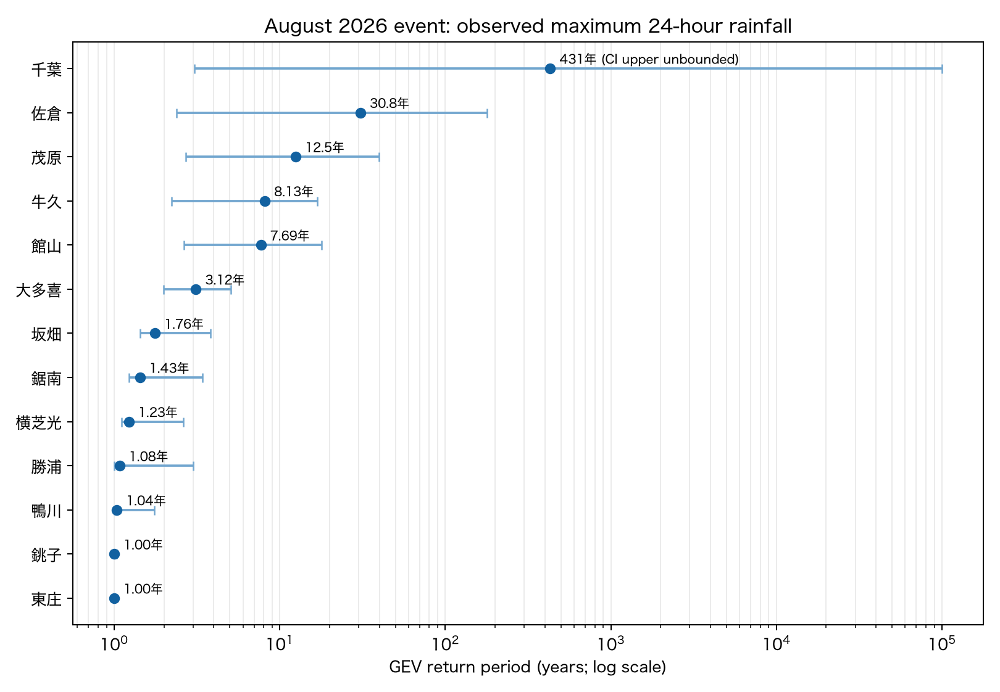
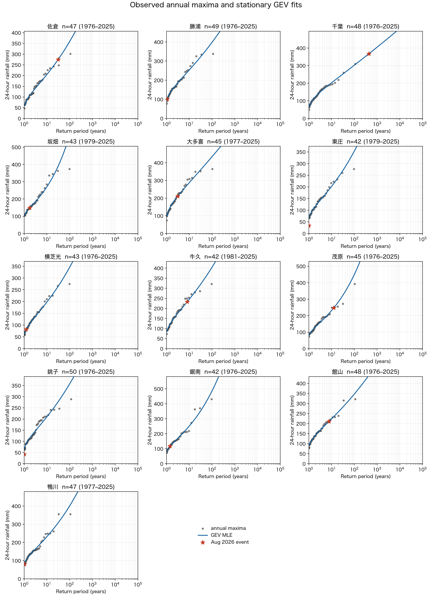
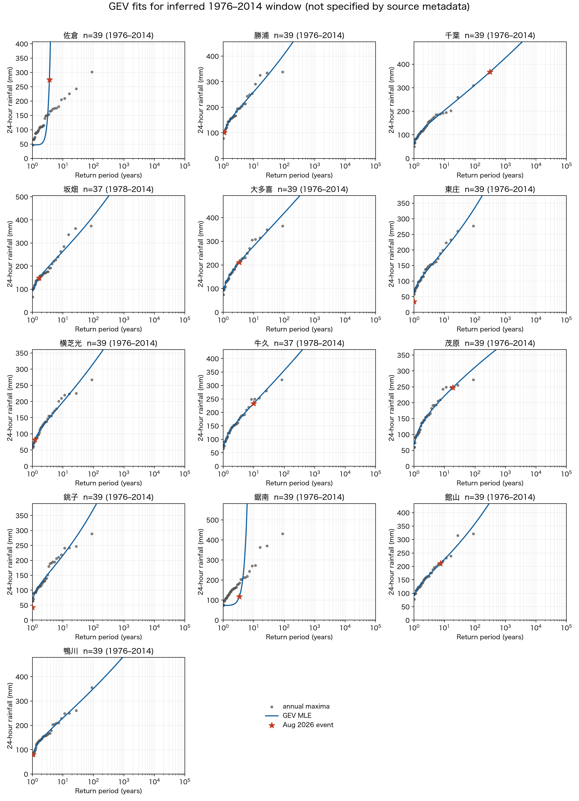
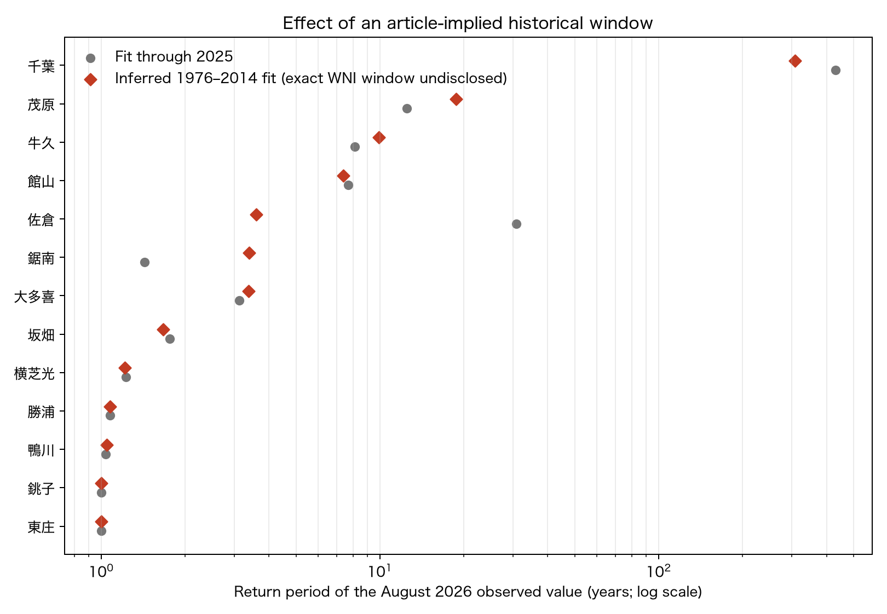

# 令和8年8月千葉豪雨：地上観測に基づく24時間雨量の確率年

## 結論

気象庁の千葉県内地上観測のうち、JMAの統計切断表示後の同一系列が40年以上あり、利用可能な年最大24時間降水量を40年分以上持つ地点を対象に、定常GEV分布を最尤推定した。2026年8月13～15日の観測最大24時間雨量を、事象から独立な2025年までの分布に照らした主解析では、最大の点推定は **千葉の431年** だった。1万年を超えた地点は **0地点** である。

ただし、記事の574.2 mmは千葉市緑区～市原市東部の「解析雨量」（格子値）であり、地上観測所の値ではない。今回の地上観測解析は、その574.2 mm自体の確率年を直接検証するものではなく、同じ豪雨を既存観測所で捉えた場合の局地ごとの頻度を示す。両者の空間代表性の違いを無視した一対一比較はできない。

## 地点別結果

主解析の「確率年」は2025年まででGEVを推定した値。95%区間は年最大値を地点ごとに再標本化した非パラメトリック・ブートストラップ（2,000回）のパーセンタイル区間。「2026含む」は今回値を標本に追加して再推定した感度分析である。

| 地点 | 学習期間 | 今回24h (mm) | 既往最大 (mm) | 確率年 | 95%ブートストラップ区間 | 2026含む |
|---|---:|---:|---:|---:|---:|---:|
| 千葉 | 1976–2025 (48年) | 367.0 | 309.0 | 431年 | 3.05年 – 上限なし | 119年 |
| 佐倉 | 1976–2025 (47年) | 274.5 | 301.5 | 30.8年 | 2.39年 – 178年 | 25.2年 |
| 茂原 | 1976–2025 (45年) | 247.5 | 392.0 | 12.5年 | 2.72年 – 39.7年 | 11.6年 |
| 牛久 | 1981–2025 (42年) | 233.0 | 321.0 | 8.13年 | 2.22年 – 16.9年 | 7.83年 |
| 館山 | 1976–2025 (48年) | 211.0 | 321.5 | 7.69年 | 2.64年 – 18.0年 | 7.42年 |
| 大多喜 | 1977–2025 (45年) | 211.5 | 365.0 | 3.12年 | 1.99年 – 5.09年 | 3.08年 |
| 坂畑 | 1979–2025 (43年) | 149.0 | 374.0 | 1.76年 | 1.44年 – 3.83年 | 1.77年 |
| 鋸南 | 1976–2025 (42年) | 117.5 | 431.0 | 1.43年 | 1.23年 – 3.42年 | 1.44年 |
| 横芝光 | 1976–2025 (43年) | 82.5 | 274.5 | 1.23年 | 1.11年 – 2.61年 | 1.24年 |
| 勝浦 | 1976–2025 (49年) | 101.5 | 338.0 | 1.08年 | 1.00年 – 3.00年 | 1.08年 |
| 鴨川 | 1977–2025 (47年) | 80.5 | 355.0 | 1.04年 | 1.01年 – 1.75年 | 1.04年 |
| 銚子 | 1976–2025 (50年) | 42.5 | 289.0 | 1.00年 | 1.00年 – 1.03年 | 1.01年 |
| 東庄 | 1979–2025 (42年) | 34.0 | 277.0 | 1.00年 | 1.00年 – 1.00年 | 1.00年 |

対象外：香取（連続26年）、我孫子（連続15年）、成田（連続22年）、木更津（連続18年）、船橋（連続26年）





## 記事文言から推定した期間での再計算（1976～2014年）

**注意：1976～2014年は元データdescriptionに明記された期間ではない。** 記事の「1995年を中心とする約39年間」を中央年の前後19年と読み、かつCMIP6 historical runが2014年で終わることから逆算した条件付きの推定である。ウェザーニューズが極値統計に実際に切り出した開始・終了年は、記事にも元データdescriptionにも記載されていない。

元データdescriptionを確認すると、NASA NEX-GDDP-CMIP6はhistoricalが1950～2014年、SSPが2015～2100年である。NIES2020で「39年」と明記されるのは極値統計の標本期間ではなく、CDFDMバイアス補正の基準期間 **1980～2018年** で、その内訳はhistorical runの1980～2014年とSSP585 runの2015～2018年である。この1980～2018年を記事の「1995年中心の過去気候期間」と読み替える根拠はないため、本図には採用していない。

上記の推定期間に固定し、地点は主解析の13地点から再選別せず、数値が掲載されている年最大24時間雨量を品質記号 `]` も含めて使用した。したがって牛久・坂畑は観測掲載開始の関係で37値、その他は最大39値である。この期間だけで推定した最大の点推定は **千葉の308年** だった。

| 地点 | 使用期間 | 年最大値数 | 今回24h (mm) | 期間内最大 (mm) | 確率年 |
|---|---:|---:|---:|---:|---:|
| 千葉 | 1976–2014 | 39 | 367.0 | 309.0 | 308年 |
| 茂原 | 1976–2014 | 39 | 247.5 | 272.0 | 18.7年 |
| 牛久 | 1978–2014 | 37 | 233.0 | 321.0 | 9.89年 |
| 館山 | 1976–2014 | 39 | 211.0 | 321.5 | 7.40年 |
| 佐倉 | 1976–2014 | 39 | 274.5 | 301.5 | 3.59年 |
| 鋸南 | 1976–2014 | 39 | 117.5 | 431.0 | 3.39年 |
| 大多喜 | 1976–2014 | 39 | 211.5 | 365.0 | 3.38年 |
| 坂畑 | 1978–2014 | 37 | 149.0 | 374.0 | 1.67年 |
| 横芝光 | 1976–2014 | 39 | 82.5 | 267.0 | 1.21年 |
| 勝浦 | 1976–2014 | 39 | 101.5 | 338.0 | 1.07年 |
| 鴨川 | 1976–2014 | 39 | 80.5 | 355.0 | 1.05年 |
| 銚子 | 1976–2014 | 39 | 42.5 | 289.0 | 1.00年 |
| 東庄 | 1976–2014 | 39 | 34.0 | 277.0 | 1.00年 |





この追加計算のGEV入力はブロック最大法としての年最大値である。「フィルタなし」は、年最大値の品質記号による除外と地点の再選別を行わない、という意味で実装した。日々の24時間雨量をすべてGEVへ投入するPOT解析ではない。

## 方法と再現性

- 出典は気象庁「過去の気象データ検索」の年ごとの値（詳細・N時間降水量）と2026年8月の日ごとの値。取得URLとSHA-256は `data/raw/manifest.json` に保存した。
- 気象庁HTMLの `data_2t_*` 表示を統計切断として扱い、その後の最新系列が40年以上かつ利用可能な年最大値40個以上の地点を適格とした。資料不足値 `]` は除外したが、それ自体は統計切断とはみなしていない。依頼に従い測器・観測方法の変更補正は行っていない。
- GEVの形状母数は通常の記法 ξ（SciPyの `genextreme` の形状母数とは符号が逆）。最尤推定を用いた。
- 主解析は今回事象を分布推定から除外し、推定対象と評価対象を分離した。感度分析では今回値を1年追加した。
- 再現期間は `T = 1 / (1 - F(x))`。これは「T年ごとに規則的に起きる」の意味ではなく、定常性を仮定した年超過確率の逆数である。

再実行：

```bash
uv sync
uv run chiba-rain --bootstrap 2000
```

## 解釈上の限界

40～数十年の標本から数百～数千年以上へ外挿すると、GEV形状母数のわずかな違いで確率年が桁違いになる。区間上限が「上限なし」の地点は、ブートストラップ標本の2.5%以上で生存確率が数値上ゼロまたは分布上端を超えたことを表す。したがって極端に長い点推定は精密な暦年数ではなく、「観測期間よりはるかに稀」という定性的証拠として扱うべきである。

また、気候の非定常性を無視した定常GEVであり、温暖化の寄与率は評価していない。観測とモデルは目的が異なるため、観測GEVだけで気候シミュレーションを否定することも、39年間のモデル時系列だけで極端な再現期間を確定することもできない。客観的な比較には、解析雨量を観測所位置に抽出した値との整合確認、モデルの観測再現性評価、アンサンブル数・バイアス補正・極値推定の不確実性開示が必要である。

## 参照資料

- [ウェザーニュース：千葉県で500mm超の記録的大雨](https://weathernews.jp/news/202608/140251/)
- [NASA NCCS：NEX-GDDP-CMIP6 dataset description](https://www.nccs.nasa.gov/data-collections/nex-gddp-cmip6/)
- [国立環境研究所：NIES2020 dataset description](https://www.nies.go.jp/doi/10.17595/20210501.001.html)
- [気象庁：過去の気象データ検索（千葉県の地点選択）](https://www.data.jma.go.jp/stats/etrn/select/prefecture.php?prec_no=45)
- [銚子地方気象台：千葉県における気温・降水量の経年変化](https://www.data.jma.go.jp/choshi/shosai/bousai/history_rain.html)
- [気象庁：気象観測データの品質と均質性](https://www.jma.go.jp/jma/kishou/know/stats/dounyu_3.html)
