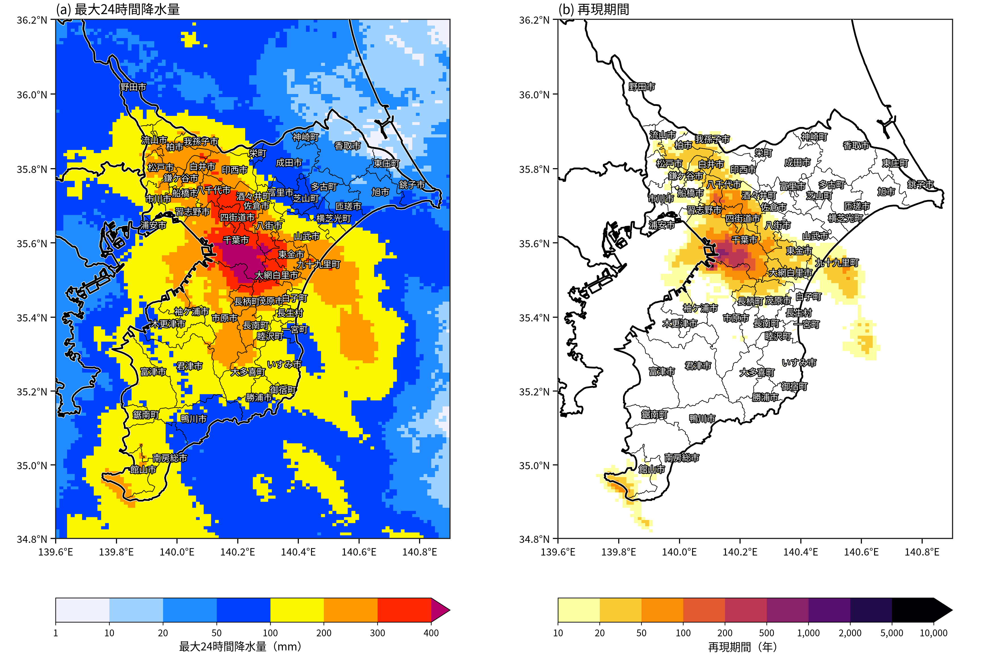
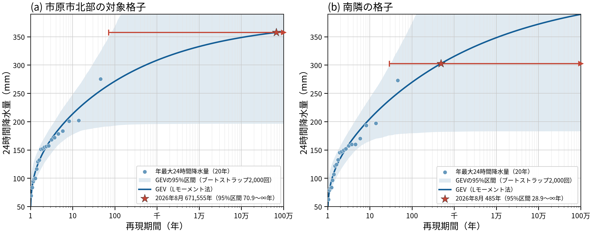

# 解析雨量を用いた令和8年8月千葉豪雨の再現期間の計算

## はじめに

[前回の記事](report.md)では、『千葉県で500mm超の記録的大雨「過去ならほぼ起こり得ない規模」の発生確率が温暖化で2倍以上に』で示された再現期間について、アメダスの地上観測を用いて検討した。そこでは、2026年8月13～15日の千葉豪雨の最大24時間降水量について、千葉アメダスでは約300年という再現期間が得られた。一方、元記事の再現期間はアメダスから推定した値より大きい傾向にあり、その一因として日降水量と24時間降水量の時間定義の不整合を挙げた。

ただし、元記事が評価対象としているのは面的な解析雨量であり、前回はオープンデータとして入手できるアメダスを用いていた。今回は、解析雨量を用いて、年最大24時間降水量を求めて格子ごとに極値分布を当てはめ、8月の千葉豪雨の再現期間を面的に計算した。

## データと手法

### 解析雨量

気象庁の解析雨量のうち、毎正時の1時間降水量（約1 km格子、経度0.0125°×緯度1/120°）を用いた。

2006年1月～2025年12月の20年間について、各格子で連続する24時間分の1時間降水量を1時間ずつずらしながら積算し、年最大24時間降水量を求めた。24時間の値は、連続する24個の1時間降水量がすべてそろう場合にのみ計算した。2006年は1月1日から2月中旬を中心に計673時間分のデータが得られなかったが、有効な24時間の値が得られる期間から年最大値を求めた。その他の年に得られなかったデータは合計31時間である。

事例の最大24時間降水量は、2026年8月13日00時～15日24時の期間に完全に含まれる24時間の最大値とした。

元記事で使われた速報版解析雨量は10分ごとに作成されるため、24時間の区切りを10分刻みで選べる。本解析では1時間刻みの解析雨量を用いたので、事例の最大24時間降水量は元記事の値より小さくなることがある。たとえば千葉市内の格子の最大値は560.9 mmで、元記事の「千葉市緑区から市原市東部」の574.2 mmより小さい。

### 再現期間の計算

前回の記事と同様に、各格子の年最大24時間降水量に定常GEV分布を当てはめ、Lモーメント法で母数を推定した。推定には20年分の年最大値がすべてそろう格子のみを用いた。2026年の事例は推定に含めず、事例の最大24時間降水量 $x$ について再現期間を $T = 1 / (1 - F(x))$ として計算した。事例の雨量が推定されたGEV分布の上限を超える場合は、再現期間を∞とした。

### アメダスを用いた解析期間の比較

前回の記事で1976～2014年の解析の対象とした千葉県内13地点について、アメダスと解析雨量の値を比較した。アメダスの最大24時間降水量は、気象庁「過去の気象データ検索」の日別値から取得した。解析雨量の値は、各アメダス地点に最も近い格子から取り出した。

アメダスの再現期間は、前回と同じ1976～2014年（牛久と坂畑は37年、その他は39年）の年最大24時間降水量に基づく値と、解析雨量と同じ2006～2025年の20年間に基づく値の2通りを計算した。いずれもLモーメント法による定常GEV分布を用い、2026年の事例は推定に含めていない。

### 解析コードについて

この解析や文章執筆はCodexとClaudeを使用して行った。これは[GitHubリポジトリ](https://github.com/wm-ytakano/chiba-heavy-rain)から参照できる。

## 結果

### 最大24時間降水量と再現期間の分布

図1に、2026年8月13～15日の解析雨量による最大24時間降水量と、その再現期間を示す。

最大24時間降水量が400 mmを超えた範囲は、千葉市南部から市原市北部、大網白里市、東金市、八街市にかけて広がった。
千葉県内の最大値は千葉市内の560.9 mmで、8月14日0時までの24時間の値である。

再現期間が100年を超えた格子は図の範囲内で107格子あり、千葉市から市原市北部にかけての範囲と、八千代市・佐倉市付近に分布した。
再現期間のピークの位置は、降水量のピークの位置よりも西側に位置している。

**図1　2026年8月13～15日の解析雨量による (a) 最大24時間降水量と (b) 再現期間。** 再現期間は、2006～2025年の年最大24時間降水量に格子ごとに当てはめた定常GEV分布から求めた。(a) の区分境界は1、10、20、50、100、200、300、400 mm。(b) の区分境界は10、20、50、100、200、500、1,000、2,000、5,000、10,000年で、10年未満と推定できない格子は白で示す。

### 市町村別の最大値

次に、気象警報等に用いられる市町村等の予報区域別に、格子の最大24時間降水量を並べると、表1のようになった。

元記事では、10分刻みの速報版解析雨量による24時間降水量として、「千葉市緑区から市原市東部」で574.2 mmであり、頻度にすると1万年を大きく超える規模としている。
一方、この解析の最大値では千葉市で560.9 mm、市原市で553.4 mmであり、対応する再現期間はそれぞれ144年と201年であった。

**表1　2026年8月13～15日の市町村別の最大24時間降水量（上位10市町村）。** 各市町村の境界内に中心がある格子のうち、最大24時間降水量が最大の格子について、その格子の再現期間を併記した。

| 順位 | 市町村 | 最大24時間降水量（mm） | 再現期間 |
|---:|---|---:|---:|
| 1 | 千葉市 | 560.9 | 144年 |
| 2 | 市原市 | 553.4 | 201年 |
| 3 | 大網白里市 | 438.7 | 54.3年 |
| 4 | 八街市 | 419.6 | 60.4年 |
| 5 | 東金市 | 401.2 | 50.0年 |
| 6 | 四街道市 | 399.2 | 86.7年 |
| 7 | 佐倉市 | 393.4 | 85.9年 |
| 8 | 茂原市 | 391.3 | 41.6年 |
| 9 | 八千代市 | 373.0 | 114年 |
| 10 | 長柄町 | 362.2 | 27.7年 |

市町村別の最大再現期間と対応する降水量を並べると、表2のようになった。
元記事では、「千葉市緑区から市原市東部」が1万年を大きく超えるとしており、本解析でも市原市において1万年を大きく超える値が確認された。

一方、元記事の「東金・大網白里付近の373.0mmは約1,182年に1度」に対して、本解析の降水量は東金市で400.4 mm、大網白里市で438.7 mmと多い一方、再現期間はいずれも50年程度と元記事と比べてかなり小さい。

**表2　2026年8月13～15日の市町村別の最大再現期間（上位10市町村）。** 各市町村の境界内の格子のうち再現期間が最大の格子について、その格子の最大24時間降水量を併記した。

| 順位 | 市町村 | 最大24時間降水量（mm） | 再現期間 |
|---:|---|---:|---:|
| 1 | 市原市 | 357.5 | 672,000年 |
| 2 | 千葉市 | 370.9 | 791年 |
| 3 | 八千代市 | 359.2 | 135年 |
| 4 | 佐倉市 | 357.2 | 106年 |
| 5 | 四街道市 | 399.2 | 86.7年 |
| 6 | 八街市 | 389.3 | 64.3年 |
| 7 | 館山市 | 227.2 | 62.4年 |
| 8 | 大網白里市 | 438.7 | 54.3年 |
| 9 | 東金市 | 400.4 | 50.1年 |
| 10 | 茂原市 | 376.9 | 49.4年 |

### 再現期間が1万年を超えた格子

再現期間が1万年を超えたのは、市原市北部の1格子（東経140.1063°、北緯35.5375°）のみだった。
隣接する8格子の再現期間は66～486年で、この格子を除くと、千葉県内の再現期間の最大は千葉市内の791年となった。
この格子と、隣接8格子のうち再現期間が最も長かった南隣の格子（北緯35.5292°）について、年最大24時間降水量とGEV分布を図2に示す。

図2(a)の格子では、今回の357.5 mmは、2006～2025年の年最大24時間降水量の最大値275.1 mmを大きく上回った。このように過去20年に経験のない大雨を評価する場合、再現期間は観測された範囲の外側、すなわちGEV分布の裾の形によって決まる。この格子では形状母数 $\xi$ が−0.183と負で、推定されたGEV分布には上限（379.0 mm）がある。今回の雨量はこの上限に近いため、再現期間が約67万年と非常に長く算出された。

ただし、20年分の年最大値から推定したGEV分布には大きな不確実性がある。20個の年最大値を復元抽出して再推定するブートストラップ法（2,000回）で95%区間を求めると、図2(a)の格子の再現期間の下限は70.9年だった。また、リサンプルの約半数では今回の雨量が推定された分布の上限を超え、再現期間は∞となった。

さらに、約1 km南の図2(b)の格子では、過去20年の最大値は272.8 mmと図2(a)とほぼ同じだが、形状母数は−0.140で、今回の302.5 mmは485年に対応した。図2(a)と比べて今回の雨量は55.0 mm少なく、再現期間は3桁小さい。このように、1格子隣でも再現期間の点推定値は大きく変わる。

**図2　市原市北部の (a) 再現期間が1万年を超えた格子と (b) その南隣の格子における年最大24時間降水量とGEV分布。** 青点は2006～2025年の年最大24時間降水量で、Gringortenのプロット位置 $T = (n + 0.12) / (n - i + 0.44)$（$n = 20$、$i$ は昇順の順位）に置いた。青線はLモーメント法で当てはめた定常GEV分布、薄青の帯は20個の年最大値を復元抽出して2,000回再推定したブートストラップ法による95%区間、赤い星は推定に含めていない2026年8月13～15日の最大24時間降水量と再現期間を示す。星から延びる横線はその再現期間の95%区間で、右端の矢印は上限が∞であることを示す。

### 解析期間の違いが再現期間に与える影響

ここまでの結果では、元記事と本解析の再現期間に違いがみられた。この違いには、使用しているデータの違いだけでなく、分布の推定に用いる過去データの期間の違いも関係している。データについては、元記事は速報版解析雨量の事例値を気候シミュレーションデータから推定した分布で評価しているのに対し、本解析は解析雨量の事例値を同じ解析雨量から推定した分布で評価している。期間については、元記事の「過去の気候」は1995年を中心とする約39年間（前回の記事では1976～2014年と解釈）であるのに対し、本解析は2006～2025年の20年間である。

文部科学省・気象庁の[「日本の気候変動2025」第5章5-1](https://www.data.jma.go.jp/cpdinfo/ccj/2025/html_honpen/cc2025_honpen_5.html)によると、全国のアメダス約1,300地点当たりに換算した日降水量300 mm以上の平均年間日数は、1976～1985年と2015～2024年の比較で約1.9倍に増加した。同報告書は、地球温暖化が大雨の頻度と強度の増加に既に影響していると評価している。このことから、分布の推定に用いる期間が異なれば、同じ雨量に対する再現期間は変わると考えられる。

1 km格子の解析雨量は2006年以降しか利用できない。そこで、1970年代からの観測があるアメダスを用いて、1976～2014年と2006～2025年のそれぞれから推定した再現期間を比べ、解析期間の違いが再現期間の算出にどれだけ影響するかを評価した。あわせて、同じ2006～2025年について解析雨量から推定した再現期間も比較した。結果を表3に示す。

**表3　2026年8月13～15日のアメダスと解析雨量の最大24時間降水量と再現期間の比較。** アメダスの1976～2014年に基づく再現期間の上位10地点を、その順に示す。アメダスの1976～2014年の値は前回の記事と同じ。解析雨量はアメダス地点に最も近い格子の値である。

| 地点 | アメダス （mm） | アメダスGEV  1976～2014年 | アメダスGEV  2006～2025年 | 解析雨量 （mm） | 解析雨量GEV  2006～2025年 |
|---|---:|---:|---:|---:|---:|
| 千葉 | 367.0 | 299年 | 119年 | 391.0 | 112年 |
| 佐倉 | 274.5 | 39.4年 | 22.6年 | 333.7 | 33.3年 |
| 茂原 | 247.5 | 16.5年 | 11.0年 | 243.6 | 10.0年 |
| 牛久 | 233.0 | 9.40年 | 8.18年 | 229.0 | 5.54年 |
| 館山 | 211.0 | 7.26年 | 6.31年 | 220.8 | 6.74年 |
| 大多喜 | 211.5 | 3.32年 | 3.42年 | 198.9 | 2.47年 |
| 坂畑 | 149.0 | 1.73年 | 1.68年 | 157.9 | 1.68年 |
| 鋸南 | 117.5 | 1.35年 | 1.53年 | 152.9 | 2.02年 |
| 横芝光 | 82.5 | 1.23年 | 1.21年 | 101.6 | 1.61年 |
| 勝浦 | 101.5 | 1.08年 | 1.07年 | 81.1 | 1.01年 |

まず、アメダスで解析期間の違いを比べる。表3の上位5地点ではいずれも、2006～2025年に基づく再現期間が1976～2014年に基づく値より短かった。特に千葉では、1976～2014年の299年に対して2006～2025年では119年と、約4割になった。佐倉では39.4年から22.6年、茂原では16.5年から11.0年となった。再現期間が数年以下の地点では、両者の差は小さかった。

次に、同じ2006～2025年に基づく再現期間を、アメダスと解析雨量で比べる。解析雨量は約1 km格子の面的な値であり、地点で観測するアメダスとはデータの性質が異なるため、降水量そのものではなく、それぞれのデータの過去の年最大値に対する再現期間を比較する。千葉では、アメダスで119年、解析雨量で112年と近い値になった。茂原（11.0年と10.0年）、牛久（8.18年と5.54年）、館山（6.31年と6.74年）でも、両者の差は数年以内だった。一方、佐倉では、アメダスの22.6年に対して解析雨量では33.3年と長かった。
